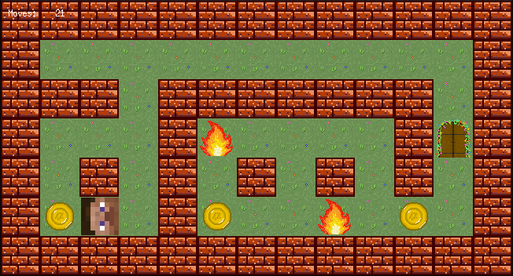

# so_long

This project is part of the 42 School curriculum and involves creating a small 2D game using the MiniLibX library.
The goal is to navigate a character through a map to collect items and reach an exit.



## Table of Contents

- [Overview](#overview)
- [Project Structure](#project-structure)
- [Requirements](#requirements)
- [Installation](#installation)
- [Usage](#usage)
- [Gameplay](#gameplay)
- [Map Description](#map-description)
- [Bonus](#bonus)

## Overview

The `so_long` project is a simple 2D game where the player controls a character to collect all items on the map and reach the exit.
The game is built using the MiniLibX library and includes basic features like character movement and collision detection.

## Project Structure


- `libs/` - Directory containing external libraries used in the project.
  - `printf/` - Directory for the custom implementation of the `printf` function.
  - `libft/` - Directory for the custom implementation of the standard C library functions.
  - `minilibx/` - Contains the MiniLibX library, which is cloned into the repository during the build process.
- `start_game/` - Directory containing the source code related to starting and managing the game.
  - `events.c` - Functions for handling user input and game events.
  - `fill_textures.c` - Functions for loading and applying textures to game elements.
  - `start_game.c` - Functions for initializing and starting the game.
- `textures/` - Directory containing the texture files used in the game (e.g., images for walls, player, collectibles).
- `utils/` - Directory containing utility functions and helper scripts used throughout the project.
- `validate_map/` - Directory containing source code for validating the map's shape, borders, texture characters, and performing flood fill checks.
- `Makefile` - Makefile for building the project, specifying compilation rules and dependencies.
- `main.c` - Entry point of the program.
- `map.ber` - Sample map file used to define the layout of the game level.
- `parse_map.c` - Functions for parsing the map file and converting it into a usable game format.
- `so_long.h` - Header file containing function prototypes, macro definitions, and global variables used across the project.

## Requirements

- A Unix-like operating system (Linux, macOS)
- GCC (GNU Compiler Collection)
- MiniLibX library
- Make

## Installation

1. Clone the repository:
```bash
git clone https://github.com/mariusz-smajdor/so_long.git && cd so_long
```

2. Build the project:
```bash
make
```

## Usage

Run the program with the following command:
```bash
./so_long path_to_map_file
```

Example:
```bash
./so_long map.ber
```

## Gameplay

The objective of the game is to collect all the items on the map and reach the exit.
Use **W**, **A**, **S**, **D** keys to move the character.

## Map Description
The map is surrounded by walls (1), ensuring the player cannot move out of bounds.
The player (P), moves by pressing **W**, **A**, **S**, **D** keys.
Collectible items (C) are placed at different locations, requiring the player to navigate the entire map to collect them.
Obstacles (M) are placed to create a challenging path for the player.
The exit (E), the player has to navigate through the map and collect all items to reach it.

## Bonus

The bonus part of the project includes additional features such as:

- Obstacles that can cause the player to lose the game.
- Animated sprites for the player.
- Enhanced map elements and interactions.
